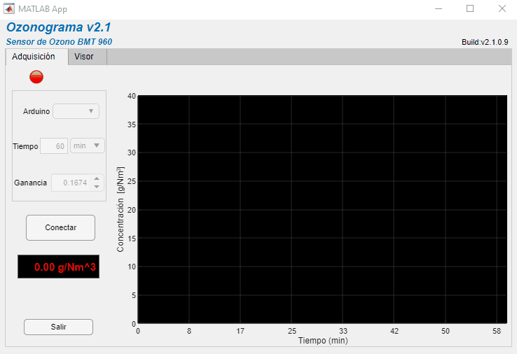
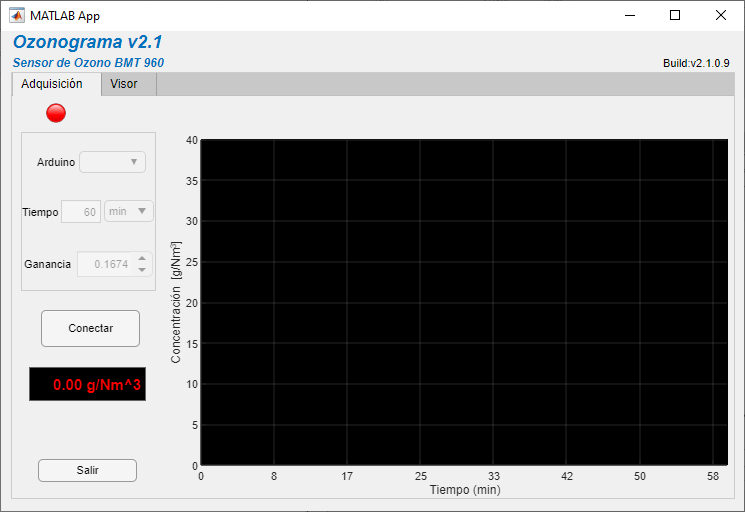
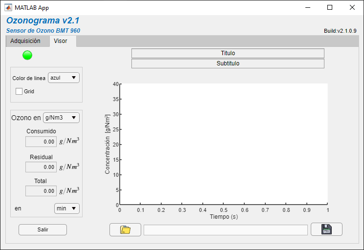

# Ozone Graph App v2.1.0.9
Aplicación para la adquisión de datos del sensor de ozono BMT 960 por medio de Arduino, para uso en el Laboratorio de Investigación en Ingeniería Química Ambiental (LAIIQA - ESIQIE - IPN).

## Adquisición

Una vez conectado el arduino a la computadora, y al hacer click en `Conectar`, el programa se conetará automaticamente al puerto `COM` del Arduino.

El botón `Conectar` cambiará a `Iniciar` para comenzar la lectura de la señal.

## Visor de archivos

 Al finalizar se puede observar el ozonograma generado en la pestaña `Visor`, donde se muestra el ozono **consumido**, **residual** y **total**, a un flujo de `0.5 L/min` con una concentración máxima aproximada de `35 g/Nm^3` (metros cúbicos Normales: 0°C a nivel del mar).

 El ozonograma generado puede guardar en los formatos `.mat`, `.xlsx`, `.csv` y `.txt`.
